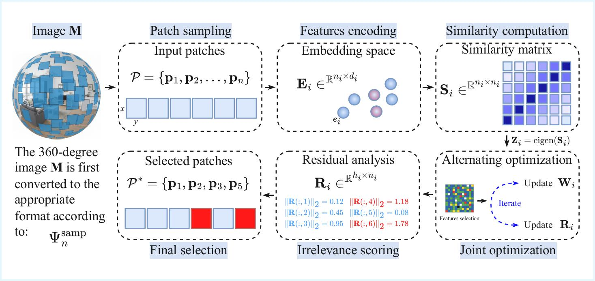

# Similarity-Preserving Instance Selection for Data-Efficient 360-Degree Image Quality Assessment

This repository contains the code associated with the article **Similarity-preserving instance selection with residual-based outlier detection for data-efficient omnidirectional image quality assessment**, currently under review.

Patch-based deep networks dominate omnidirectional (360-degree) image quality assessment, but the construction of their training sets stops at deciding *where to look*. The resulting patch collections are large and strongly correlated, so a substantial fraction of the training signal is redundant. This work formulates the overlooked stage that follows sampling — deciding *which* of the sampled patches to keep — as an instance-selection problem posed in embedding space.

The selection module sits between sampling and training and is agnostic to both the sampling operator and the downstream architecture: it never inspects either, only the embeddings the sampler produces.



**Figure**: Diagram illustrating the components of the proposed study. This repository provides the code for the *embedding similarity-selection* component.

**Note:** The code associated with patch sampling, encoding and quality estimation can be delivered on demand.

## Method

Patch embeddings `E` (2048-d, from a frozen ImageNet-pretrained ResNet-50) are mapped to a low-dimensional space by a transformation `W` constrained to preserve their pairwise similarity structure, while a residual matrix `R` absorbs the samples that structure cannot explain:

```
min_{W, R}  ‖E W − Z − Rᵀ‖²_F  +  α ‖W‖_{2,1}  +  β ‖R‖_{2,1}
```

where `Z` is obtained from the eigendecomposition of the similarity matrix `S` such that `S = Z Zᵀ`. The `ℓ2,1` penalty on `W` keeps the mapping supported on few feature directions; the `ℓ2,1` penalty on `R` makes it column-sparse, so that the `ℓ2` norm of each column of `R` is a direct per-sample **irrelevance score**. Patches are ranked by that score in ascending order and the top-`k` are retained.

The problem is bi-convex and solved by alternating minimisation with closed-form updates for `W` and `R`. The objective is proved to be non-increasing and converges within 6–8 iterations in practice. Per-iteration complexity is `O(h·d(d + n))`, i.e. linear in the number of patches and independent of the downstream model.

## Key results

- A baseline regressor matches or exceeds its full-data accuracy while retaining only **40–50%** of the sampled patches on CVIQ, OIQA and MVAQD.
- This holds across three structurally different sampling operators (uniform ERP, latitude-aware LAT, scanpath-driven SP) and across Euclidean, Manhattan and Mahalanobis similarities.
- Used as a drop-in preprocessing module for four state-of-the-art models (SAP-Net, MC360IQA, SAL-360IQA, Assessor360), the same selection removes **20–40%** of their computational load at equal or better accuracy.
- A multi-factor ANOVA shows that the similarity measure and the projection dimension `h` have no statistically detectable effect on performance, leaving the **selection rate as the only quantity that requires tuning**.

## Features

- **Distance metrics**: similarity matrix construction using Euclidean, Manhattan or Mahalanobis distance.
- **Dimensionality reduction**: eigendecomposition of the similarity matrix to obtain the optimal low-dimensional target `Z`.
- **Joint optimisation**: closed-form alternating updates of the transformation matrix `W` and the residual matrix `R`, with monotone convergence.
- **Irrelevance scoring**: per-patch scores read directly off the column norms of the converged residual, with no separate heuristic criterion.

## Installation

Requires Python 3.8+ and the following packages:

```bash
pip install numpy scipy
```

(`argparse` and `pickle` are part of the standard library.)

## Usage

```bash
python emb_selection.py -sim [SIMILARITY_METRIC] -mat [PATH_TO_FEATURE_FILE]
```

### Arguments

- `-sim`: similarity distance metric. Choose from `MAN` (Manhattan), `MAH` (Mahalanobis) or `EUC` (Euclidean). (Required)
- `-mat`: path to the `.mat` file containing the feature data. (Required)

### Recommended settings

Because neither the distance metric nor the projection dimension has a measurable effect on selection quality, both can be fixed at their cheapest values:

| Hyper-parameter | Recommended | Note |
|---|---|---|
| Similarity metric | `EUC` | Cheapest; best or near-best in most configurations |
| Projection dimension `h` | `10` | Flat accuracy from `h = 1` to `h = 2048` |
| Selection rate | `0.4`–`0.5` | The only parameter worth tuning; 0.6–0.7 for pre-tuned architectures |

Expect the alternating optimisation to stabilise within 6–8 iterations.

## Output

The script generates a `.pkl` file named `R_matrix_[SIM].pkl`, where `[SIM]` is the similarity metric used. It contains the matrices `W` and `R` together with the optimisation details. The per-patch irrelevance scores are the `ℓ2` norms of the columns of `R`; sorting them in ascending order and keeping the first `k` gives the selected subset.

## Datasets

The three benchmarks used in the paper are publicly available from their respective authors:

- **CVIQ** — 528 distorted images from 16 references (JPEG, AVC, HEVC), homogeneous compression distortions.
- **OIQA** — 320 images from 16 references (JPEG, JPEG 2000, Gaussian noise, Gaussian blur), moderate heterogeneity.
- **MVAQD** — 300 images from 15 references (JPEG, JPEG 2000, HEVC, blur, white noise), the most heterogeneous of the three.

## Citation

```bibtex
@article{sendjasni2025similarity,
  title   = {Similarity-preserving instance selection with residual-based outlier
             detection for data-efficient omnidirectional image quality assessment},
  author  = {Sendjasni, Abderrezzaq and Benkabou, Seif-Eddine and Larabi, Mohamed-Chaker},
  year    = {2025},
  note    = {Under review}
}
```

## Authors

- **Dr. Abderrezzaq Sendjasni**, XLIM, Univ. de Poitiers
- **Dr. Seif-Eddine Benkabou**, Univ. de Poitiers
- **Prof. Mohamed-Chaker Larabi**, XLIM, Univ. de Poitiers

## Acknowledgements

This work is partially funded by the Nouvelle-Aquitaine Research Council under project REALISME AAPR2022-2021-17027310.

## License

This project is licensed under the MIT License — see the [LICENSE](LICENSE) file for details.
